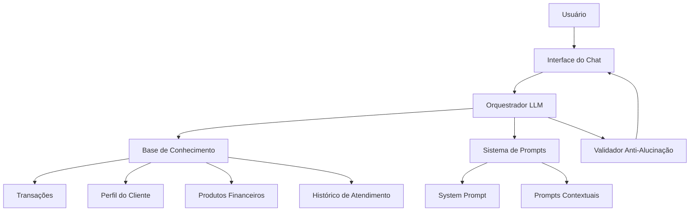

# 🤖💰 Guia Financeiro Inteligente - Agente IA Generativa

[](https://www.python.org/downloads/)
[](LICENSE)
[](https://dio.me)

> Um assistente financeiro inteligente que utiliza IA Generativa para oferecer consultoria personalizada, antecipar necessidades e cocriar soluções financeiras de forma proativa e segura.

## 📋 Índice

- [Visão Geral](#-visão-geral)
- [Características](#-características)
- [Arquitetura](#-arquitetura)
- [Estrutura do Projeto](#-estrutura-do-projeto)
- [Instalação](#-instalação)
- [Uso](#-uso)
- [Base de Conhecimento](#-base-de-conhecimento)
- [Documentação](#-documentação)
- [Tecnologias](#-tecnologias)
- [Roadmap](#-roadmap)
- [Contribuindo](#-contribuindo)
- [Licença](#-licença)

## 🎯 Visão Geral

Este projeto é um laboratório de desenvolvimento de um **agente financeiro inteligente** que vai além de simples chatbots. Utilizando IA Generativa, o agente é capaz de:

- 🔮 **Antecipar necessidades** do cliente antes mesmo dele perguntar
- 🎯 **Personalizar recomendações** com base no perfil e histórico
- 💡 **Cocriar soluções** financeiras de forma consultiva
- 🛡️ **Garantir segurança** e confiabilidade nas respostas

### 🚀 Diferenciais

- **Proatividade**: Não apenas responde, mas sugere ações baseadas em análise de dados
- **Contextualização**: Entende o momento financeiro do usuário
- **Segurança**: Implementa técnicas anti-alucinação para respostas confiáveis
- **Personalização**: Adapta tom de voz e recomendações ao perfil do cliente

## ✨ Características

### 🤝 Consultoria Personalizada
- Análise de perfil do investidor
- Sugestões de produtos financeiros adequados
- Alertas proativos sobre oportunidades

### 📊 Análise Inteligente
- Processamento de histórico de transações
- Identificação de padrões de gastos
- Previsões e tendências financeiras

### 🔒 Segurança e Confiabilidade
- Sistema anti-alucinação
- Validação de respostas contra base de conhecimento
- Transparência nas recomendações

### 🎨 Experiência do Usuário
- Interface conversacional natural
- Tom de voz adaptável
- Respostas contextualizadas

## 🏗️ Arquitetura



## 📁 Estrutura do Projeto

```
📦 dio-lab-gui-guia-financeiro/
│
├── 📄 README.md                         # Este arquivo
│
├── 📂 data/                             # 🗄️ Base de conhecimento (dados mockados)
│   ├── transacoes.csv                   # Histórico de transações
│   ├── historico_atendimento.csv        # Atendimentos anteriores
│   ├── perfil_investidor.json           # Perfil e preferências
│   └── produtos_financeiros.json        # Catálogo de produtos
│
├── 📂 docs/                             # 📚 Documentação técnica
│   ├── 01-documentacao-agente.md        # Caso de uso e arquitetura
│   ├── 02-base-conhecimento.md          # Estratégia de dados
│   ├── 03-prompts.md                    # Engenharia de prompts
│   ├── 04-metricas.md                   # Sistema de avaliação
│   └── 05-pitch.md                      # Apresentação do projeto
│
├── 📂 src/                              # 💻 Código fonte
│   ├── app.py                           # Aplicação principal
│   ├── prompts/                         # Templates de prompts
│   ├── utils/                           # Utilitários
│   └── models/                          # Modelos e integrações
│
├── 📂 examples/                         # 📖 Exemplos de implementação
│   └── README.md                        # Guia de referência
│
├── 📂 assets/                           # 🎨 Recursos visuais
│   └── diagramas/                       # Diagramas de arquitetura
│
├── 📂 tests/                            # 🧪 Testes automatizados
│   └── test_agente.py
│
├── 📄 requirements.txt                  # Dependências do projeto
├── 📄 .gitignore                        # Arquivos ignorados
└── 📄 LICENSE                           # Licença MIT
```

## 🚀 Instalação

### Pré-requisitos

- Python 3.8 ou superior
- pip (gerenciador de pacotes Python)
- Git

### Passo a Passo

1. **Clone o repositório**
```bash
git clone https://github.com/romulomarani/dio-lab-gui-guia-financeiro.git
cd dio-lab-gui-guia-financeiro
```

2. **Crie um ambiente virtual** (recomendado)
```bash
python -m venv venv

# Windows
venv\Scripts\activate

# Linux/Mac
source venv/bin/activate
```

3. **Instale as dependências**
```bash
pip install -r requirements.txt
```

4. **Configure as variáveis de ambiente**
```bash
# Copie o arquivo de exemplo
cp .env.example .env

# Edite o arquivo .env com suas credenciais
# OPENAI_API_KEY=sua-chave-aqui
# ou use outras LLMs disponíveis
```

5. **Execute a aplicação**
```bash
streamlit run src/app.py
```

## 💡 Uso

### Iniciando uma Conversa

```python
# Exemplo de uso programático
from src.agente import AgenteFinanceiro

agente = AgenteFinanceiro()
resposta = agente.consultar("Quais são as melhores opções de investimento para o meu perfil?")
print(resposta)
```

### Interface Web

Acesse `http://localhost:8501` após executar a aplicação com Streamlit.

### Exemplos de Perguntas

- "Como está minha situação financeira atualmente?"
- "Quais investimentos você recomenda para o meu perfil?"
- "Há algum gasto incomum no meu histórico?"
- "Como posso economizar R$ 500 por mês?"

## 🗄️ Base de Conhecimento

O agente utiliza dados mockados que simulam informações reais de um cliente:

| Arquivo | Formato | Conteúdo |
|---------|---------|----------|
| `transacoes.csv` | CSV | Histórico de receitas e despesas |
| `historico_atendimento.csv` | CSV | Conversas anteriores do cliente |
| `perfil_investidor.json` | JSON | Perfil de risco e preferências |
| `produtos_financeiros.json` | JSON | Catálogo de produtos disponíveis |

Esses dados podem ser adaptados ou expandidos conforme a necessidade do seu caso de uso.

## 📚 Documentação

A documentação completa está disponível na pasta [`docs/`](docs/):

1. **[Documentação do Agente](docs/01-documentacao-agente.md)** - Caso de uso, persona e arquitetura
2. **[Base de Conhecimento](docs/02-base-conhecimento.md)** - Estratégia de dados e integração
3. **[Engenharia de Prompts](docs/03-prompts.md)** - System prompts e exemplos
4. **[Métricas e Avaliação](docs/04-metricas.md)** - Como avaliamos a qualidade
5. **[Pitch do Projeto](docs/05-pitch.md)** - Apresentação executiva

## 🛠️ Tecnologias

### Core

- **Python 3.8+** - Linguagem principal
- **Streamlit** - Interface web interativa
- **LangChain** - Orquestração de LLMs
- **Pandas** - Manipulação de dados

### LLMs Suportados

- OpenAI GPT (ChatGPT)
- Google Gemini
- Anthropic Claude
- Microsoft Copilot
- Ollama (modelos locais)

### Ferramentas de Desenvolvimento

- **Mermaid** - Diagramas de arquitetura
- **Pytest** - Testes automatizados
- **Black** - Formatação de código
- **Pylint** - Análise estática

## 🗺️ Roadmap

### Versão 1.0 (Atual)
- [x] Estrutura base do projeto
- [x] Dados mockados
- [x] Templates de documentação
- [ ] Protótipo funcional básico

### Versão 1.1 (Próxima)
- [ ] Interface Streamlit completa
- [ ] Integração com múltiplas LLMs
- [ ] Sistema de métricas automatizado
- [ ] Testes unitários

### Versão 2.0 (Futuro)
- [ ] Análise preditiva avançada
- [ ] Integração com APIs bancárias reais
- [ ] Dashboard de visualização
- [ ] Sistema de notificações proativas
- [ ] Suporte multilíngue

## 🤝 Contribuindo

Contribuições são bem-vindas! Para contribuir:

1. Faça um fork do projeto
2. Crie uma branch para sua feature (`git checkout -b feature/MinhaFeature`)
3. Commit suas mudanças (`git commit -m 'Adiciona MinhaFeature'`)
4. Push para a branch (`git push origin feature/MinhaFeature`)
5. Abra um Pull Request

### Diretrizes

- Siga o padrão de código existente
- Adicione testes para novas funcionalidades
- Atualize a documentação conforme necessário
- Mantenha commits claros e descritivos

## 📜 Licença

Este projeto está licenciado sob a Licença MIT - veja o arquivo [LICENSE](LICENSE) para detalhes.

## 👨‍💻 Autor

**Rômulo Marani**

- GitHub: [@romulomarani](https://github.com/romulomarani)
- LinkedIn:(https://www.linkedin.com/in/rômulo-marani-martins-0ab28222a?utm_source=share_via&utm_content=profile&utm_medium=member_android) 

## 🙏 Agradecimentos

- [Digital Innovation One (DIO)](https://dio.me) - Pelo desafio e plataforma de aprendizado
- Comunidade open source - Pelas ferramentas incríveis
- Você - Por conferir este projeto!

---

<div align="center">

**[⬆ Voltar ao topo](#-guia-financeiro-inteligente---agente-ia-generativa)**

Feito com ❤️ e ☕ por [Rômulo Marani](https://github.com/romulomarani)

Se este projeto foi útil, considere dar uma ⭐!

</div>
